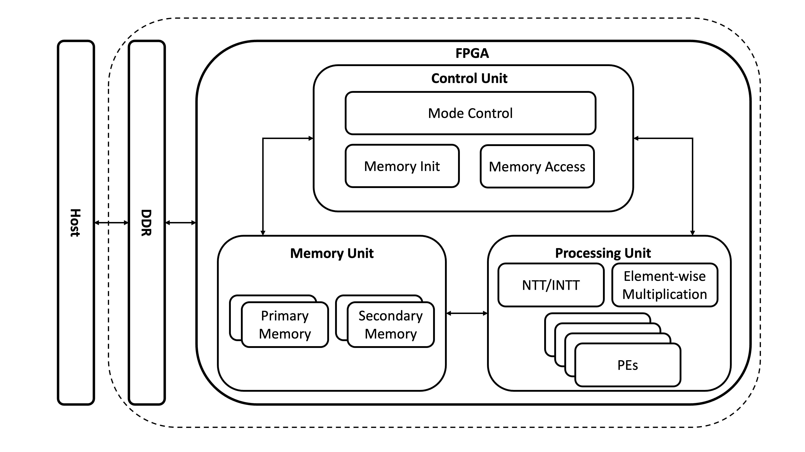
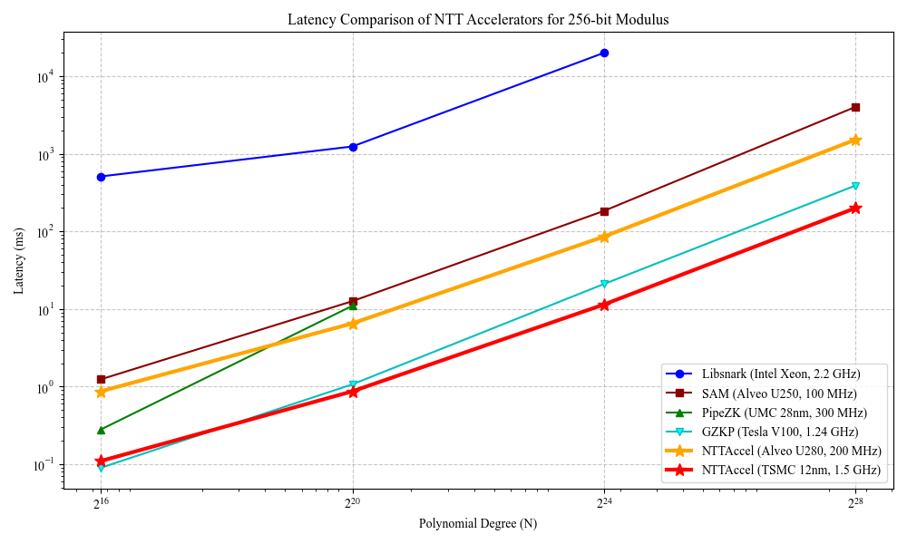
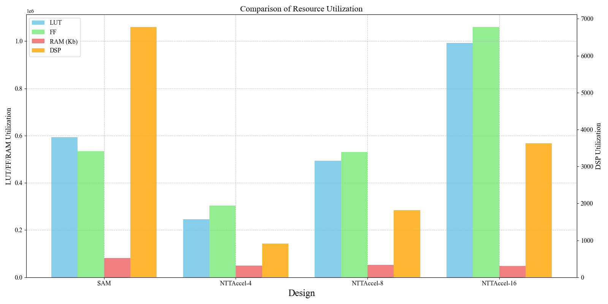
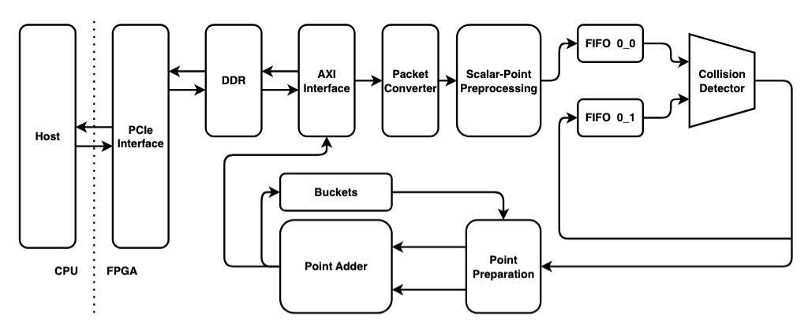
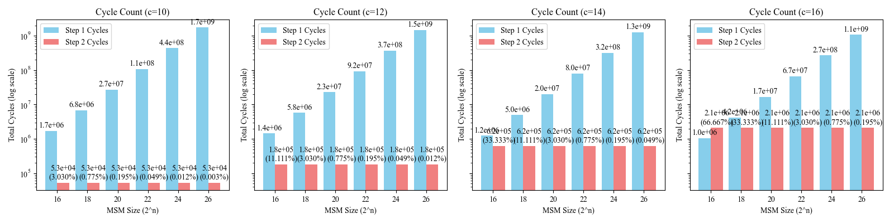
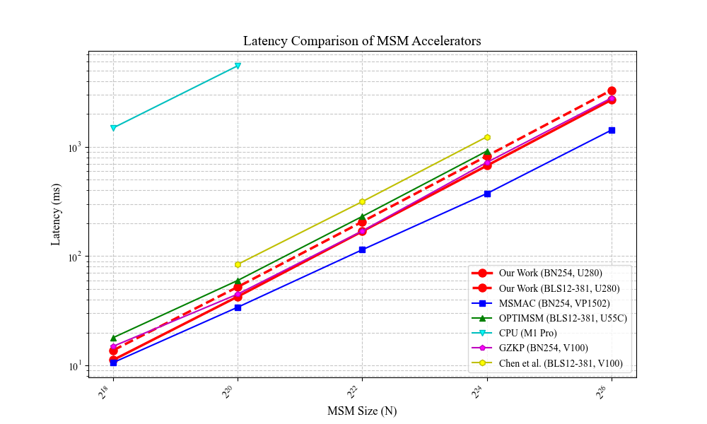
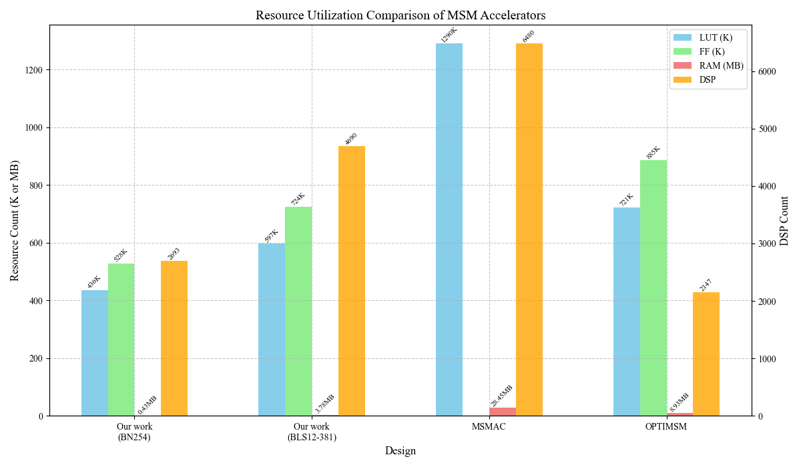

# 🚀 ZKAccel: zkSNARK Hardware Acceleration

  <em>🌟Speed Up zkSNARK, Empower Privacy Computing🌟</em>

## 🔑 Core Value
Zero-Knowledge Proofs (ZKPs) are powerful but **computationally expensive**.  
ZKAccel provides a **hardware-software co-design** to accelerate zkSNARK proof generation, delivering:
- ⚙️ **Hardware acceleration** for key operations (e.g., NTT, MSM)
- ⚡ **Faster proof generation** (low latency, high throughput)  
- 🌍 **Scalable and versatile** architecture for multiple SNARK constructions (Groth16, Spartan, Hyperplonk…)

## 📜 Background
The Zero-Knowledge Proof (ZKP) enables one party (the prover) to prove a statement to others (the verifiers) without revealing additional information beyond the validity of the statement. It is a fundamental primitive in modern cryptography to protect data privacy and to ensure computation integrity. Recently, ZKPs have found urgent practical applications in various cutting-edge domains, including blockchain, privacy-preserving cryptocurrencies, zero-knowledge static program analysis, verifiable fully homomorphic encryption, and machine learning. Thus, a amount of efforts have been devoted towards making ZKPs practically efficient for these applications.

For efficiency concerns, the Zero-Knowledge Succinct Non-Interactive Argument of Knowledge (zk-SNARK) has emerged as a critical innovation and promising approach (e.g., Groth16, Marlin, Sonic, Plonk, STARK, Hyperplonk). On a high-level overview, a zk-SNARK protocol roughly consists of two phases: the proof generation phase (by the prover) and the verification phase (by the verifiers). For the latter phase, zk-SNARKs on current status have succeeded in enabling rapid verification of proofs. On the other hand, the proof generation phase of zk-SNARKs remains slow and resource-intensive. Thus, designing and implementing hardware accelerators for zk-SNARK proof generation has become an interesting and significant research topic to meet urgent practical demands. Researchers from both academic and industrial fields have been keeping developing the state of the art on the efficiency of zk-SNARK proof generation.

---

## 🏗️ ZKAccel Architecture Overview
Following similar motivation, we propose a project, **ZKAccel**, to accelerate zkSNARK proof generation through hardware-software co-design, targeting the most computationally expensive components. By leveraging both hardware (e.g., FPGA/ASIC) and software optimizations, it significantly reduces proof generation time, enabling faster and more scalable privacy-preserving applications. This project contains four core acceleration modules (NTT, MSM, SC, MT) and a low level optimized process element design (modular multiplier). all optimized designs can work together in a unified architecture to accelerate different SNARK constructions including Groth16, Spartan, Hyperplonk and so on.

The diagram below illustrates the structure of the project, showing the three main acceleration targets (NTT, MSM, Sumcheck) and the supporting modules for Merkle tree processing and big integer modular multiplication.

Fig. 1: ZKAccel Architecture Overview

Main Components consist of :
- **Number Theoretic Transform** (NTT)
- **Multi-Scalar Multiplication** (MSM)
- **Sumcheck with Equality MLE Builder** (SC)
- **Merkle Tree** (MT)

Both of these components rely on a core process element design:
- **Modular Multiplier Array** (MMA)

*Note: The usual Merkle tree implementation relys on Hash function. Hash function is based on the permutation and subtitution which don't need to compute modular multiplier. In our project, we consider the zk-friendly hash function which relys on the modular multiplier array.*

---
## 💡 NTTAccel

### Number Theoretic Transform
The Number Theoretic Transform (NTT) is a key time-consuming operation during the ZKP proof generation phase. Modern ZKP applications demand large-scale and wide-bitwidth NTTs, presenting a formidable hardware challenge.
The workflow of a NTT for 8 points polynomial is as follows:

Fig. 2: ZKHardware NTT Workflow

### The Challenge & Our Solution
**The Challenge**
Existing hardware acceleration solutions for these "large-scale and wide-bitwidth NTTs" are crippled by two major bottlenecks:
- **Computational Resource Bottleneck**: Generating the necessary twiddle factors on-the-fly consumes a huge number of computational units (like DSP slices on FPGAs), severely limiting parallelism.
- **Memory Resource Bottleneck**: Pre-computing and storing all twiddle factors requires gigabytes of on-chip memory—far beyond the capacity of current hardware.

**Our Solution: NTTAccel**
Our subproject, NTTAccel, was born to solve this fundamental problem. We've designed a scalable and resource-efficient NTT hardware accelerator that features a unique twiddle factor management scheme. This innovation allows us to be the first to overcome both computational and memory bottlenecks simultaneously without sacrificing performance.
With its innovative architecture, NTTAccel sets a new standard for ZKP hardware acceleration, built on the following core solutions:
- **Precomputation-based twiddle factor management scheme**
  - We pioneer a "resource-efficient precomputation" approach. All twiddle factors are pre-computed and stored in external memory, then loaded on-demand in small batches. This dramatically conserves precious on-chip memory.
- **Memory addressing and access optimization**
  - We employ a unique memory addressing scheme and conflict-free parallel access mechanism  to ensure a continuous data flow and maximize the utilization of computational units.
- **A Multi-PE Parallel Architecture**
  - We implement a Multi-Processing Element (Multi-PE) architecture that allows for simultaneous processing of multiple butterfly operations. This design significantly boosts throughput and reduces latency, making it ideal for large-scale ZKP applications.

Our architecture illustrated as following:

Fig. 3: NTTAccel Architecture

### Performance
**Latency**
Compared to the recent SOTA NTT accelerator, our latency is significantly reduced, demonstrating the effectiveness of our architectural innovations. The comparison is shown in the figure below.

**Resource Utilization**
Besides the advantage on latency, our architecture also optimizes resource utilization. The results is shown in the figure below.

  

    
    
Fig. 4: NTTAccel Latency Comparison

  

  

    
    
Fig. 5: NTTAccel Resource Utilization

  

---
## 💡 MSMAccel

### Multi-Scalar Multiplication (MSM)
Multi-Scalar Multiplication (MSM) is a fundamental operation in EC-based zkSNARK proof generation, enabling the efficient computation of scalar multiplications of elliptic curve points. This operation is crucial for constant-size SNARK constructions (e.g., Groth16, Plonk), group-based proof constructions (e.g., Bulletproof) as well as pairing-based cryptographic schemes like digital signatures (e.g., ECDSA, Schnorr multi-signature, BLS signature, EdDSA).

Pippenger's algorithm is a crucial algorithm for computing MSM. This algorithm operates in several steps, leveraging bit-slicing of scalars and bucketing:
- Scalar Partitioning into Windows
- Bucketing (Grouping by Coeffcients) and Bucket Accumulation
- Final Accumulation

The workflow of Pippenger' algorithm is shown as following:

Fig. 6: Pippenger Algorithm Workflow

The objective of the MSM acceleration module is to optimize the Multi-Scalar Multiplication (MSM) computation, which is another critical component in zkSNARK proof generation. By employing hardware-software co-design strategies, we aim to achieve substantial improvements in MSM processing times, thus further reducing the overall proof generation latency.

### The Challenge & Our Solution
### The Challenge
While ZK-SNARKs have revolutionized cryptography with their succinctness, the proof generation phase remains a major performance bottleneck. A key culprit is Multi-Scalar Multiplication (MSM), a computationally intensive operation that can account for over 70% of the total proof generation time. Existing solutions, whether based on GPUs or dedicated hardware, face significant limitations:
- **Inefficient Point Adder Design**: Exisiting solutions (e.g., GPU) offer parallelism but are inefficient due to high power consumption and slow elliptic curve point addition, the fundamental building block of MSM.
- **Incompatible Architecture Design**: Most existing dedicated hardware accelerators are narrowly focused, either supporting only a limited set of elliptic curves or lacking the efficiency and versatility required for a broader range of ZKP protocols. This lack of flexibility makes them ill-suited for the diverse and evolving ZKP ecosystem.

**Our Solution: MSMAccel**
We have designed MSMAccel, a versatile and highly efficient MSM accelerator that tackles these challenges head-on. Our solution is built on a novel hardware-software co-design strategy, focusing on three key innovations:

1. **A Highly Efficient and Universal Point Adder**: We have developed a groundbreaking, pipelined elliptic curve (EC) point adder. By leveraging the extended Jacobian coordinate system, our design significantly reduces the number of modular multipliers from 14 to just 10, resulting in superior resource efficiency (fewer DSPs). Unlike prior designs, our point adder is highly versatile and compatible with a wide range of elliptic curves, including BN254 and BLS12-381, making it a truly universal solution for the ZKP community.

2. **Optimal Hardware-Aware Parameterization**: Our architecture is tailored to the widely-adopted Pippenger's algorithm. We have performed a detailed analysis to identify optimal parameters that strike the perfect balance between high performance and minimal resource consumption. This ensures our accelerator can achieve maximum speed while operating within the constrained resources of FPGA platforms.

3. **Scalable and Pipelined Architecture**: MSMAccel employs a multi-stage pipelined design to maximize throughput and minimize latency. The efficient data flow, combined with our resource-optimized point adder, allows us to achieve superior acceleration, significantly outperforming both CPU-based solution and existing hardware-based solutions. Our solution is designed for scalability, supporting MSM computations from $N=2^{18}$ to $N=2^{26}$.

By combining these innovations, MSMAccel provides a robust, efficient, and versatile solution for accelerating a critical bottleneck in ZK-SNARK proof generation, paving the way for faster and more practical ZKP applications.
Our architecture illustrated as following:

  
  
Fig. 7: MSMAccel Architecture

### Performance
**Cycle Count**
To optimize the latency, we test the optimized configuration of window size. The test result is shown as follows:

  
  
Fig. 8: Cycle Count with Different Window Sizes

**Latency**
Compared to the recent SOTA MSM accelerator, our latency is significantly reduced, demonstrating the effectiveness of our architectural innovations. The comparison is shown in Fig. 9.

**Resource Utilization**
Besides the advantage on latency, our architecture also optimizes resource utilization. The results is shown in Fig. 10.

  

    
    
Fig. 9: MSMAccel Latency Comparison

  

  

    
    
Fig. 10: MSMAccel Resource Utilization

  

---
## 🔧 Auxiliary Modules

Besides the above three core modules, we also implement several auxiliary modules to further enhance the overall performance of the zkSNARK system.
- **Merkle Tree**: This module focuses on optimizing the construction and verification of Merkle trees, which are essential for ensuring data integrity and authenticity in zkSNARKs. We employ hardware acceleration techniques to improve the efficiency of hash computations and tree traversal.
- **Modular Multiplier**: This module is dedicated to optimizing the modular multiplication operation based on Barret Reduction and Karatsuba algorithm. Modular multiplication is a critical operation in zkSNARKs as well as many cryptographic algorithms. We leverage hardware acceleration to achieve higher throughput and lower latency in modular arithmetic computations.

---
## 🤝 Partnerships & Intellectual Property

True innovation comes from collaboration. We are actively working with **zhcltech (中昊芯英)** across the industry to solve some of the biggest challenges in the ZKP hardware acceleration.

Our technical expertise has been translated into tangible intellectual property:
- **零知识证明的硬件加速方法以及相关装置，专利号: 202411221648.1**
- **一种旋转因子的编码、读取方法及装置、介质及芯片，专利号: 202411276602.X, 202411276600.0**
- **一种数论变换加速方法、装置、介质及芯片，专利号: 202411276598.7**
- **椭圆曲线加法群的硬件加速方法以及相关装置，专利号: 202411267730.8**
